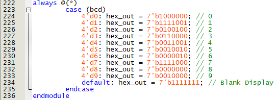
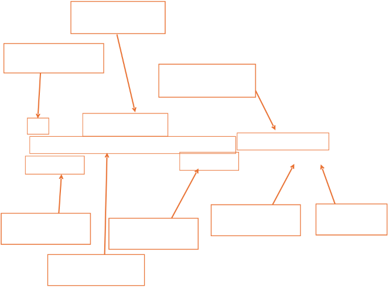

**Department of Electrical and Electronics Engineering Faculty of Engineering** 

**ASSIGNMENT REPORT 
EEE3473-INDIVIDUAL ASSIGNMENT SEMESTER V 2024/2025** 

**TITLE** 

**Access Gate Control for a Gate that Open with an RFID Card** 

**ADVISOR** 

**Dr. Anis Shahida Niza Binti Mokhtar** 

|**No.** |**Name** |**Matric No.** |
| - | - | - |
|**1.** |**LEE KAH CHUN** |**2220847** |

**Table of Contents** 

1. **Solution** 
1. **Design of Finite State Machine(FSM)** 
1. **Netlist Viewer** 
1. **Register Transfer Level(RTL) Viewer** 
1. **State Diagram Viewer** 
2. **Code Explanation** 
   1. **Top Module** 
   1. **bin\_to\_bcd Module** 
   1. **seven\_seg Module** 
   1. **close Module** 
   1. **open Module** 
   1. **ClockDivider Module** 
   1. **Pin Plannar** 
2. **DE2-115 Field Programmable Gate Array(FPGA) Result** 
   1. **Pinout Board Overview** 
   1. **State Transition Result** 
   1. **Video Demonstration** 
2. **Discussion** 
2. **Conclusion** 
2. **Reference** 
1. **Solution** 
1. **Design of Finite State Machine(FSM)** 

*“8. Access Gate control for a gate that open with an RFID card.”* 

I approach this challenge by first dividing the system into clear operational phases that mirror how an access gate typically functions. I start by identifying the various stages— waiting for an RFID scan, checking the scan, approving or denying access, and then managing the mechanical opening or closing of the gate. Next, I define what happens at each stage, such as displaying different messages to users while waiting, indicating “Granted” or “Denied,” and enabling the gate to move. I map out each trigger that causes the system to progress from one phase to another—for instance, a correct RFID code leads to a “Granted” state, while an incorrect one leads to “Denied.” Once the roadmap of states and transitions is established, I incorporate essential components like the RFID reader, a mechanism to drive the gate, and any indicators or display modules needed. This approach ensures that the system remains organized, straightforward to test, and easy to refine as I finalize the design. 

*RFID Technology Overview* 

RFID (Radio Frequency Identification) operates by transmitting data wirelessly through radio waves between an RFID tag (often embedded in a card or key fob) and an RFID reader. When an RFID card is brought within range of the reader, the reader emits an electromagnetic field that powers the tag’s internal circuitry. The powered tag then responds by sending its stored identification data back to the reader. This data is checked against an authorized database—if the tag’s data is recognized, access is granted; otherwise, access is denied. 

In my project, I replicate this same security check using a password rather than radio-based signals. Instead of the reader-wireless-tag exchange, I rely on a user-entered code that is compared against a pre-set “valid password” in my system. Conceptually, both methods achieve the same goal: verifying credentials before granting access. The primary difference lies in the medium of data transfer—RFID relies on radio frequency signals, while my project uses a direct input method for password verification. 

2. **Netlist Viewer** 
1. **Register Transfer Level(RTL) Viewer** 

Open Door 

Close Door 

Binary to BCD Converter 

Clock Divider 

7 Segment Hex Out 

State Machine 

*RTL Viewer* 

|**Function** |**Module Instances** |
| - | - |
|Clock Divider ||
|Close Door Effect LED Shifting ||
|Open Door Effect LED Shifting ||
|Binary to BCD converter ||

|Seven Segment Output Display ||
| :- | - |

2. **State Machine Viewer** 

*State Machine Viewer* 

- IDLE State: In the IDLE state, the system sits in a neutral position awaiting user interaction. No credential checks or door movements take place at this time. Instead, the system showing “IDLE” on the 7-segment displays and set an indicator LED to let the user know the system is ready. Once the user presses the “start” switch, the state machine transitions from IDLE to the VAL state, initiating the authentication process. 
- VAL (Validation) State: The VAL state handles the crucial step of verifying whether the user’s input credentials match the preset or stored password. In a typical RFID or password-based system, the user’s data is compared against a known pattern, in my case, I set 11010 as authentication password. If the user has not yet pressed the button to confirm their input, the VAL state continues waiting. Once verification input is pressed, the system checks the entered credentials. A successful match triggers a transition to the GRANTED state, while a mismatch sends the system to the DENIED state. 
- GRANTED State: Entering the GRANTED state indicates that the user-supplied password or RFID code has been successfully authenticated. Here, the system displays a confirmation message on the 7-segment displays spelling out a simplified “PASS” and success indicator all green LED lights up. The user then has the option to move to the OPEN state by pressing another signal, which effectively instructs the system to open the door. If c is not triggered, the state machine remains in GRANTED until the user decides to proceed. 
- DENIED State: If the validation check fails in the VAL state, the system transitions to the DENIED state. This state presents a rejection or error message on the displays, typically spelling out “DENIED” or a similar indicator to inform the user that access was not authorized. Forcing the user to perform a reset or re-enter the system from IDLE. This prevents unauthorized repeated attempts without first resetting the system or reloading 

  credentials. 

- OPEN State: Upon receiving the “OPEN” signal from the GRANTED state, the system moves to the OPEN state to physically open the gate or door. In the Verilog code, this may involve setting a door signal high and assigning an “open” animation pattern to the led output through the open module. The module’s logic animates the LEDs to visually indicate the door’s movement, eventually reaching a steady state that signifies the door is fully open. The state machine remains here until it detects a “close” command (signal d), initiating the closing procedure. 
- CLOSE State: Once the user triggers the “close” command (d) while in the OPEN state, the system transitions to CLOSE. Similar to the OPEN state, a specialized close module manages a separate LED animation, showing the door returning from open to closed position. Once fully closed, the system typically waits for an additional signal to return to the IDLE state. This final step resets the system to its neutral state, ready to begin the authentication process again for the next user. 

*Transition State Table* 

2. **Code Explanation** 
1. **Top Module: digitalAssign** 

The **digitalAssign** module is the main controller in this design. It implements a state machine to control the behavior of a digital lock system with the following features: 

1. **State Machine** with six states: 
- **IDLE** 
- **VAL (VALIDATION)** 
- **DENIED** 
- **GRANTED** 
- **OPEN** 
- **CLOSE** 
2. **Password Checking**: Validates a user-entered 5-bit password (i1, i2, i3, i4, i5) against a known password. 
2. **Door Control**: Shows when the door is open or closed, and transitions the door’s LED patterns accordingly using the open and close modules. 
2. **Slower Clock Generation**: Utilizes a ClockDivider instance to generate a slower clock for state transitions. 
2. **Display Indicators**: Drives multiple **7-segment displays** (status1–status5) and a single 7-segment output (HEX), as well as 8 bits of indicator and 18 bits of led. 
1. **Inputs and Outputs** 
- **Inputs** 
1. clk: The main (fast) clock input (e.g., 50 MHz). 
1. rst: Active-high reset signal. 
1. rst\_n: Active-low reset signal. 
1. a, b, c, d, e: Control inputs used to move between states. 
1. i1, i2, i3, i4, i5: Switch inputs representing the 5-bit password. 
- **Outputs** 
1. indicator[7:0]: LED indicators showing the current state(s). 
1. HEX[6:0]: A 7-segment display driven by the bin\_to\_bcd and seven\_seg modules (displays the state code). 
1. door: A signal that indicates whether the door is open (1) or closed (0). 
1. status1, status2, status3, status4, status5: Five independent 7-segment outputs showing specific words/messages depending on the state. 
1. led[17:0]: 18-bit output representing LED patterns that respond to open/close states. 
2. **Internal Signals and Registers** 
- **State Variables** 
- current\_state, next\_state: 5-bit registers for the finite state machine (though only 3 bits are used by the parameters). 
- **Control/Helper Signals** 
- result: 8-bit register used to pass the current state code to the bin\_to\_bcd module for display on the 7-segment. 
- A1: 12-bit wire that holds the BCD output from the bin\_to\_bcd converter. 
- slow\_counter: 24-bit register used inside this module to demonstrate resetting logic, though the main slow clock is generated by the ClockDivider. 
- slow\_clk: The slower clock output from the ClockDivider. 
- **LED Control for OPEN/CLOSE** 
- open\_led, close\_led: 18-bit wires connected to the outputs of the open and close submodules, respectively. 
3. **Instantiation of Submodules** 
1. **ClockDivider** 

   The ClockDivider is instantiated with a 

   parameter .DIV\_FACTOR(15\_000\_000) to generate a slow\_clk from the fast clk. 

2. **open** 

   Instantiated to produce LED patterns for the OPEN state. 

3. **close** 

   Instantiated to produce LED patterns for the CLOSE state. 

4. **bin\_to\_bcd** 

   Converts the result (binary) to a 3-digit BCD (in A1). 

5. **seven\_seg** 

   Takes the lowest 4 bits of A1 (the ones digit) and drives a 7-segment display, HEX. 

4. **Finite State Machine Logic** Below is a brief description of each state: 
1. **IDLE** 
- Sets indicator[0] high, meaning we are in IDLE. 
- Seven Segment shows a specific message on the 7-segment displays (status1–status4) show “IDLE” 
- If a == 1, transitions to **VAL**, otherwise remains in **IDLE**. 

IDLE State Case 

2. **VAL** (Validation) 
- Checks if b == 1 to verify the password. If the password matches (i1 == 1, i2 == 1, i3 == 0, i4 == 1, i5 == 0), moves to **GRANTED**, else **DENIED**. 
- “Password” is set to be 11010. 
- If b == 0, stays in **VAL**. 
- Seven Segment show “PASS” 

VAL State Case 

3. **DENIED** 
- Displays “DENIED” on some 7-segment pattern (status1–status4). 
- Stays in **DENIED** (next\_state=DENIED). 
- Seven Segment show “NOPE” 

  

DENIED State Case 

4. **GRANTED** 
- Lights up all bits of green indicator (indicator[7:0] = 8'b11111111). 
- If c == 1, moves to **OPEN**, otherwise remains **GRANTED**. 
- Status show “PASS” in seven segment 

  

GRANTED State Case 

5. **OPEN** 
- Activates door = 1. 
- Uses the open\_led pattern on the output led. 
- If d == 1, transitions to **CLOSE**, otherwise remains in **OPEN**. 
- Seven Segment show “OPEN” 

OPEN State Case 

6. **CLOSE** 
- Uses the close\_led pattern on the output led. 
- If e == 1, transitions back to **IDLE**, otherwise remains in **CLOSE**. 
- Seven Segment show “CLOSE” 

CLOSE State Case 

5. **Sequential Logic for State Transition** 

- **The FSM state transitions occur on the rising edge of slow\_clk.** 
- **An active-low reset (!rst) forces the FSM back to IDLE.** 
2. **bin\_to\_bcd Module** 

   Converts an 8-bit binary number (0–255) into a 3-digit Binary-Coded Decimal (BCD) output suitable for display on 7-segment displays or other decimal - based outputs. 

1. Input and Outputs 
- **Input**: 
  - binary [7:0]: The 8-bit binary value to be converted. 
- **Output**: 
  - bcd [11:0]: The resulting three BCD digits. The bits are typically divided as: 
    - [11:8] = Ones 
    - [15:12] = Tens 
    - [19:16] = Hundreds 

**bin\_to\_bcd Input and Output** 

2. **Double-Dabble Algorithm** 

The *double-dabble* algorithm is used. In each iteration: 

1. Check if each BCD nibble (hundreds, tens, ones) is >= 5; if yes, add 3 to that nibble. 
1. Shift left by 1 bit (concatenating in the next binary bit). 

**Double-dabble Algorithm logic** 

3. **seven\_seg Module** 
1. **Input and Outputs** 
- **Input**: 
  - bcd [3:0]: The 4-bit BCD digit (0–9) to display. 
- **Output**: 
  - hex\_out [6:0]: The 7-segment encoding for displaying digits 0–9 (or 

    blank otherwise). 

seven\_seg Input and Outputs 

2. **Implementation Hex\_out** 

**Case for each hex\_out bit** 

4. **Close  Module** 

   Generates a shifting LED pattern to visually indicate the **closing** sequence of the door. As time progresses the module updates the 18-bit output led to new patterns until it reaches a fully lit state.

1. **Input and Outputs** 
- **Inputs**: 
1. clock: The fast input clock (e.g., 50 MHz). 
1. rst\_n: Active-low reset. 
- **Output**: 

  1\.  led [17:0]: The LED pattern output. 

Close Module Input and Outputs 

2. **Simulation Door Close Logic** 
- **slow\_counter**: A 24-bit counter that increments on each rising edge of clock. When it overflows (or reaches a threshold like 24'h999999), the module toggles or shifts some bits in led. 
- **Behavior**: 
1. If !rst\_n is active, the module sets led to 18'b000000000000000000. 
1. Each time slow\_counter meets 24'h999999, the code updates led bits by shifting or toggling them. 
1. Once led == 18'b111111111111111111, it freezes without further changes. 

**LED Shifting Close simulation behaviour logic** 

5. **Open Module** 

   Similar to the close module, this module displays an **opening** LED sequence. Over time, bits in led are toggled until a specific pattern is reached (led == 18'b000000000000000000), at which point the pattern freezes. It reverse the operation from Close Module.

LED Open door simulation  

6. **ClockDivider Module** 

Generates a slower clock (clk\_out) from the high-frequency input clock (clk\_in) of 50Mhz, it crash as too fast operation. This is used, for example, to slow down the state machine transitions in digitalAssign. 

1. **Parameter** 

**DIV\_FACTOR**: Sets the division ratio. For a 50 MHz clock, a DIV\_FACTOR of 25,000,000 would produce a 1 Hz output clock. Here, it is set to 15,000,000, which would yield a roughly 3.3 Hz clock (depending on the original frequency).

2. **Inputs and Outputs** 
- **Inputs**: 
1. clk\_in: The high-frequency input clock. 
1. rst: Active-high reset. 
- **Output**: 

1\.  clk\_out: The divided/slower clock signal. 

3. **Behaviour Logic** 

A 32-bit counter increments on each rising edge of clk\_in. When the counter reaches DIV\_FACTOR - 1, it toggles clk\_out and resets the counter:

Clk\_out slower behaviour logic 

**2.6 Pin Plannar** 

Table below conclude all PINOUT set with reference with DE2-115 manual of pin preset: 

|To|Direction|Location|I/O Bank|VREF Group|Fitter Location|I/O Standard|||
| - | - | - | - | - | :- | :- | :- | :- |
||HEX[6]|Output||PIN\_AA14|3|B3\_N0|PIN\_AA14|2\.5 V|
||HEX[5]|Output||PIN\_AG18|4|B4\_N2|PIN\_AG18|2\.5 V|
||HEX[4]|Output||PIN\_AF17|4|B4\_N2|PIN\_AF17|2\.5 V|
||HEX[3]|Output||PIN\_AH17|4|B4\_N2|PIN\_AH17|2\.5 V|
||HEX[2]|Output||PIN\_AG17|4|B4\_N2|PIN\_AG17|2\.5 V|
||HEX[1]|Output||PIN\_AE17|4|B4\_N2|PIN\_AE17|2\.5 V|
||HEX[0]|Output||PIN\_AD17|4|B4\_N2|PIN\_AD17|2\.5 V|
||a|Input||PIN\_AB28|5|B5\_N1|PIN\_AB28|2\.5 V|
||b|Input||PIN\_AC28|5|B5\_N2|PIN\_AC28|2\.5 V|
||c|Input||PIN\_AC27|5|B5\_N2|PIN\_AC27|2\.5 V|
||clk|Input||PIN\_Y2|2|B2\_N0|PIN\_Y2|2\.5 V|
||d|Input||PIN\_AD27|5|B5\_N2|PIN\_AD27|2\.5 V|
||door|Output||PIN\_F17|7|B7\_N2|PIN\_F17|2\.5 V|
||e|Input||PIN\_AB27|5|B5\_N1|PIN\_AB27|2\.5 V|
||i1|Input||PIN\_Y23|5|B5\_N2|PIN\_Y23|2\.5 V|
||i2|Input||PIN\_Y24|5|B5\_N2|PIN\_Y24|2\.5 V|
||i3|Input||PIN\_AA22|5|B5\_N2|PIN\_AA22|2\.5 V|
||i4|Input||PIN\_AA23|5|B5\_N2|PIN\_AA23|2\.5 V|
||i5|Input||PIN\_AA24|5|B5\_N2|PIN\_AA24|2\.5 V|
||indicator[7]|Output||PIN\_G21|7|B7\_N1|PIN\_G21|2\.5 V|
||indicator[6]|Output||PIN\_G22|7|B7\_N2|PIN\_G22|2\.5 V|
||indicator[5]|Output||PIN\_G20|7|B7\_N1|PIN\_G20|2\.5 V|
||indicator[4]|Output||PIN\_H21|7|B7\_N2|PIN\_H21|2\.5 V|
||indicator[3]|Output||PIN\_E24|7|B7\_N1|PIN\_E24|2\.5 V|
||indicator[2]|Output||PIN\_E25|7|B7\_N1|PIN\_E25|2\.5 V|
||indicator[1]|Output||PIN\_E22|7|B7\_N0|PIN\_E22|2\.5 V|
||indicator[0]|Output||PIN\_E21|7|B7\_N0|PIN\_E21|2\.5 V|
||led[17]|Output||PIN\_H15|7|B7\_N2|PIN\_H15|2\.5 V|
||led[16]|Output||PIN\_G16|7|B7\_N2|PIN\_G16|2\.5 V|
||led[15]|Output||PIN\_G15|7|B7\_N2|PIN\_G15|2\.5 V|
||led[14]|Output||PIN\_F15|7|B7\_N2|PIN\_F15|2\.5 V|
||led[13]|Output||PIN\_H17|7|B7\_N2|PIN\_H17|2\.5 V|
||led[12]|Output||PIN\_J16|7|B7\_N2|PIN\_J16|2\.5 V|
||led[11]|Output||PIN\_H16|7|B7\_N2|PIN\_H16|2\.5 V|
||led[10]|Output||PIN\_J15|7|B7\_N2|PIN\_J15|2\.5 V|
||led[9]|Output||PIN\_G17|7|B7\_N1|PIN\_G17|2\.5 V|
||led[8]|Output||PIN\_J17|7|B7\_N2|PIN\_J17|2\.5 V|
||led[7]|Output||PIN\_H19|7|B7\_N2|PIN\_H19|2\.5 V|
||led[6]|Output||PIN\_J19|7|B7\_N2|PIN\_J19|2\.5 V|
||led[5]|Output||PIN\_E18|7|B7\_N1|PIN\_E18|2\.5 V|
||led[4]|Output||PIN\_F18|7|B7\_N1|PIN\_F18|2\.5 V|
||led[3]|Output||PIN\_F21|7|B7\_N0|PIN\_F21|2\.5 V|

||led[2]|Output||PIN\_E19|7|B7\_N0|PIN\_E19|2\.5 V|
| :- | - | - | :- | - | - | - | - | - |
||led[1]|Output||PIN\_F19|7|B7\_N0|PIN\_F19|2\.5 V|
||led[0]|Output||PIN\_G19|7|B7\_N2|PIN\_G19|2\.5 V|
||rst|Input||PIN\_M21|6|B6\_N1|PIN\_M21|2\.5 V|
||rst\_n|Input||PIN\_M23|6|B6\_N2|PIN\_M23|2\.5 V|
||status1[6]|Output||PIN\_Y19|4|B4\_N0|PIN\_Y19|2\.5 V|
||status1[5]|Output||PIN\_AF23|4|B4\_N0|PIN\_AF23|2\.5 V|
||status1[4]|Output||PIN\_AD24|4|B4\_N0|PIN\_AD24|2\.5 V|
||status1[3]|Output||PIN\_AA21|4|B4\_N0|PIN\_AA21|2\.5 V|
||status1[2]|Output||PIN\_AB20|4|B4\_N0|PIN\_AB20|2\.5 V|
||status1[1]|Output||PIN\_U21|5|B5\_N0|PIN\_U21|2\.5 V|
||status1[0]|Output||PIN\_V21|5|B5\_N1|PIN\_V21|2\.5 V|
||status2[6]|Output||PIN\_W28|5|B5\_N1|PIN\_W28|2\.5 V|
||status2[5]|Output||PIN\_W27|5|B5\_N1|PIN\_W27|2\.5 V|
||status2[4]|Output||PIN\_Y26|5|B5\_N1|PIN\_Y26|2\.5 V|
||status2[3]|Output||PIN\_W26|5|B5\_N1|PIN\_W26|2\.5 V|
||status2[2]|Output||PIN\_Y25|5|B5\_N1|PIN\_Y25|2\.5 V|
||status2[1]|Output||PIN\_AA26|5|B5\_N1|PIN\_AA26|2\.5 V|
||status2[0]|Output||PIN\_AA25|5|B5\_N1|PIN\_AA25|2\.5 V|
||status3[6]|Output||PIN\_U24|5|B5\_N0|PIN\_U24|2\.5 V|
||status3[5]|Output||PIN\_U23|5|B5\_N1|PIN\_U23|2\.5 V|
||status3[4]|Output||PIN\_W25|5|B5\_N1|PIN\_W25|2\.5 V|
||status3[3]|Output||PIN\_W22|5|B5\_N0|PIN\_W22|2\.5 V|
||status3[2]|Output||PIN\_W21|5|B5\_N1|PIN\_W21|2\.5 V|
||status3[1]|Output||PIN\_Y22|5|B5\_N0|PIN\_Y22|2\.5 V|
||status3[0]|Output||PIN\_M24|6|B6\_N2|PIN\_M24|2\.5 V|
||status4[6]|Output||PIN\_H22|6|B6\_N0|PIN\_H22|2\.5 V|
||status4[5]|Output||PIN\_J22|6|B6\_N0|PIN\_J22|2\.5 V|
||status4[4]|Output||PIN\_L25|6|B6\_N1|PIN\_L25|2\.5 V|
||status4[3]|Output||PIN\_L26|6|B6\_N1|PIN\_L26|2\.5 V|
||status4[2]|Output||PIN\_E17|7|B7\_N2|PIN\_E17|2\.5 V|
||status4[1]|Output||PIN\_F22|7|B7\_N0|PIN\_F22|2\.5 V|
||status4[0]|Output||PIN\_G18|7|B7\_N2|PIN\_G18|2\.5 V|
||status5[6]|Output||PIN\_AE18|4|B4\_N2|PIN\_AE18|2\.5 V|
||status5[5]|Output||PIN\_AF19|4|B4\_N1|PIN\_AF19|2\.5 V|
||status5[4]|Output||PIN\_AE19|4|B4\_N1|PIN\_AE19|2\.5 V|
||status5[3]|Output||PIN\_AH21|4|B4\_N2|PIN\_AH21|2\.5 V|
||status5[2]|Output||PIN\_AG21|4|B4\_N2|PIN\_AG21|2\.5 V|
||status5[1]|Output||PIN\_AA19|4|B4\_N0|PIN\_AA19|2\.5 V|
||status5[0]|Output||PIN\_AB19|4|B4\_N0|PIN\_AB19|2\.5 V|
|reset\_n|Unknown|PIN\_N21|6|B6\_N2|||||
**Pinout Table for DE2-115 Board** 

**Top View-Wire Bond for DE2-115 Board** 

3. **DE2-115 Field Programmable Gate Array(FPGA) Result** 
1. DE2-115 board Pinout Overview: 

Seven Segment Show current\_state 

State encoding 

parameter in decimal 

Green LED indicator Current State 

Reset whole FSM  Reset Door Passcode Input 5  5 Input Switch a, b,  to IDLE state  Animation 

Bit number  c, d and e 

LED Door Simulation Open & Close 

2. State Transition Result: 

|**1st to 2nd State** ||
| - | :- |
|![ref1]|![ref2]|
|**2nd to 3rd State (Passcode Correct)** ||
|![ref2]|![ref3]|
|**2nd to 4th  State (Passcode Uncorrect)** ||

|![ref2]||
| - | - |
|**3rd to 5th State** ||
|![ref3]|![ref4]|
|**5th to 6th State** ||
|![ref4]|![ref5]|
|**6th back to 1st State, will keep loop if all input high** ||
|![ref5]|![ref1]|

3. Video Demonstration of open close door animation and auto Clock system can be see by scan the QR code below: 

4. **Discussion** 

In developing this digital door lock system, one of the early discoveries was that the FPGA’s internal clock (50 MHz) proved too fast for direct use in the main state machine. When attempting to update the logic and outputs at this very high frequency, the display and LED behaviours appeared frozen or produced error states on the development board as it was transiting too fast. To overcome this, a dedicated clock divider was added to generate a slower clock signal. By reducing the update frequency (for example, to a few Hertz), it became possible to reliably drive the 7-segment displays and LEDs without overwhelming the system. This approach demonstrates the importance of proper clock management in FPGA designs, where matching the clock speed to the intended application or user interface is crucial. 

Src: https://www.terasic.com.tw/attachment/archive/502/DE2\_115\_User\_manual.pdf 

Another key constraint involved attempting to use the FPGA’s built-in LCD. In general, such LCD screens are more conveniently driven using higher-level languages (like C) and specific libraries that manage the display’s command protocol. Because this project was implemented entirely in Verilog HDL, integrating the existing LCD libraries was not straightforward. Verilog does not inherently provide library support for driving character-based LCD panels, and as a result, it became impractical to fully incorporate the LCD for displaying messages. This illustrates how hardware description languages can sometimes limit access to ready-made drivers for advanced peripherals, emphasizing the need to pick the right tools or IP cores when designing FPGA systems with sophisticated interfaces. 

To visualize the door’s open/close process in a simple yet effective manner, 18 on-board red 
LEDs were used. The code essentially simulates a door opening by shifting LED bits in one direction, and a door closing by shifting them in the opposite direction. This gives a dynamic animation that hints at door movement, despite there being no physical actuator. Implementing such a shifting pattern helps convey real-world behavior (like a door sliding) and serves as a practical demonstration of how shifting registers can be employed for visual effects with minimal hardware overhead. 

Provide a decimal readout of numeric states on the 7-segment displays, the Double-Dabble algorithm was implemented in a bin\_to\_bcd module. This classic algorithm converts an 8-bit binary value into Binary-Coded Decimal, allowing the 7-segment displays to show decimal numbers instead of raw binary patterns. The Double-Dabble approach is often found in hardware designs that require decimal displays, as it performs these conversions efficiently using shift-and-add operations. Understanding this algorithm is crucial for any digital designer who plans to render binary data into a more familiar decimal form on hardware-driven displays. 

Double-dabble Algorithm 

5. **Conclusion** 

Conclusion, this project successfully demonstrates how fundamental hardware concepts, such as state machines, clock domain management, and simple data transformations, can be integrated to create a functional digital door lock system on an FPGA. Learning working behind implementing Double-dabble Algorithm in most of the application is beneficial to me. By combining the clock divider approach with careful logic design, the system’s speed was brought under control to provide stable outputs and user-friendly interactions. Although certain constraints, particularly the limitations of using Verilog for driving the built-in LCD, introduced complexity in providing a full graphical interface, creative alternatives using on- board LEDs and 7-segment displays still achieved an effective user interface. Ultimately, this project underlines the importance of understanding both the low-level hardware description perspective and the practical considerations such as clock frequencies, hardware resource usage, and available language libraries—when designing embedded systems on an FPGA. 

6. **Reference**  
- DE2\_115\_User\_manual.PDF. (n.d.). [https://www.terasic.com.tw/attachment/archive/502/DE2_115_User_manual .pdf ](https://www.terasic.com.tw/attachment/archive/502/DE2_115_User_manual.pdf)
- Wikipedia contributors. (2024, May 19). Double dabble. Wikipedia. https://en.wikipedia.org/wiki/Double\_dabble 
- Best Sellers. (n.d.).[ https://www.wfoqfashion.shop/?ggcid=1656206 ](https://www.wfoqfashion.shop/?ggcid=1656206)
30 

[ref1]: Aspose.Words.d7a8eb0e-f0d3-491b-8721-ab92c5124994.034.png
[ref2]: Aspose.Words.d7a8eb0e-f0d3-491b-8721-ab92c5124994.035.png
[ref3]: Aspose.Words.d7a8eb0e-f0d3-491b-8721-ab92c5124994.036.png
[ref4]: Aspose.Words.d7a8eb0e-f0d3-491b-8721-ab92c5124994.038.png
[ref5]: Aspose.Words.d7a8eb0e-f0d3-491b-8721-ab92c5124994.039.png
